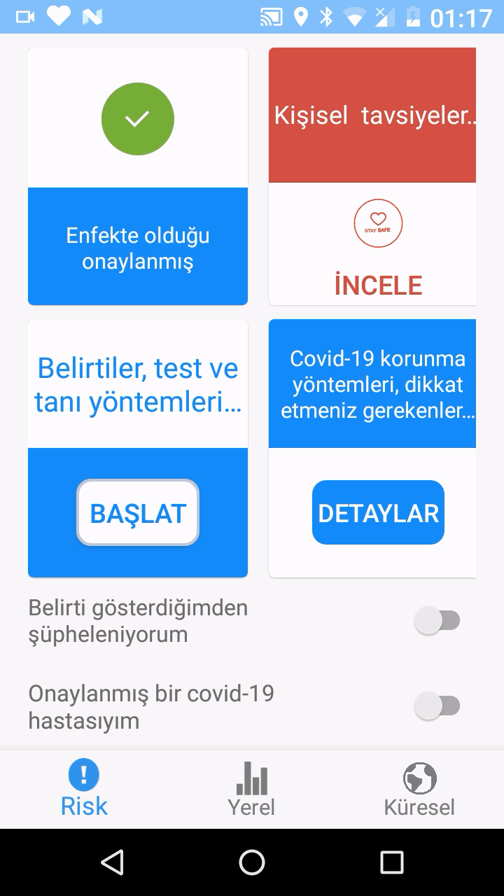

# Covid Takip

*Covid Takip* uygulaması, salgından korunmayı ve Türkiye-Dünya verilerinin görselleştirilerek anlaşılmasının kolaylaşmasını amaçlayan, Java ile yazılmış bir android projesidir. BLE(bluetooth low energy) destekli çip sete sahip cihazlarda(android 5.0-api level 21+ %97) beacon paketleri yayınlar ve diğer cihazlardan gelen paketleri tarayıp aynı UUID'ye sahip olanları çözerek gelen bilgileri işler. Bu paketler hexadecimal formatta şunları taşır:

- Uygulamaya özgü bir id, 
- Kullanıcıya özgü bir id,
- Hastalık veya şüphe durumu.

### Özellikler
<ul>
  <li><b>İnternet bağlantısı gerektirmeden riskli durumlarda anlık uyarı ve bildirim sağlanması:</b> 
    

      
      
    

  </li>
  <li><b>Demografik dağılım ve kullanıcı yaşına göre risk belirlenmesi ve dikkat edilmesi gerekenler:</b> 
    

      
      
    

  </li>
  <li><b>Covid testi: </b> 
    
  </li>
  <li><b>Covid başlangıcından günümüze seçilen tarih aralığındaki Covid-19 istatistik verilerinin 6 kategoride grafiklerle gösterimi:</b> 
    
  </li>
  <li><b>Dünya geneli İstatistikler, 217 ülke arasından her yenilendiğinde rastgele seçilen 5 ülkenin yine rastgele seçilen 4 farklı kategorideki verilerinin grafikleştirilmesi: </b> 
    
  </li>
</ul>

### Kurulum
Proje kök dizinindeki apk dosyasını android bir telefona kurarak denenebilir veya proje klonlanıp Android Studio ile çalıştırılabilir.

##### Not:
Proje, geliştirmek veya kullanmak isteyen herhangi birine açıktır. Paylaşma amacım olmadan NKU staj projesi olarak yazdım.
